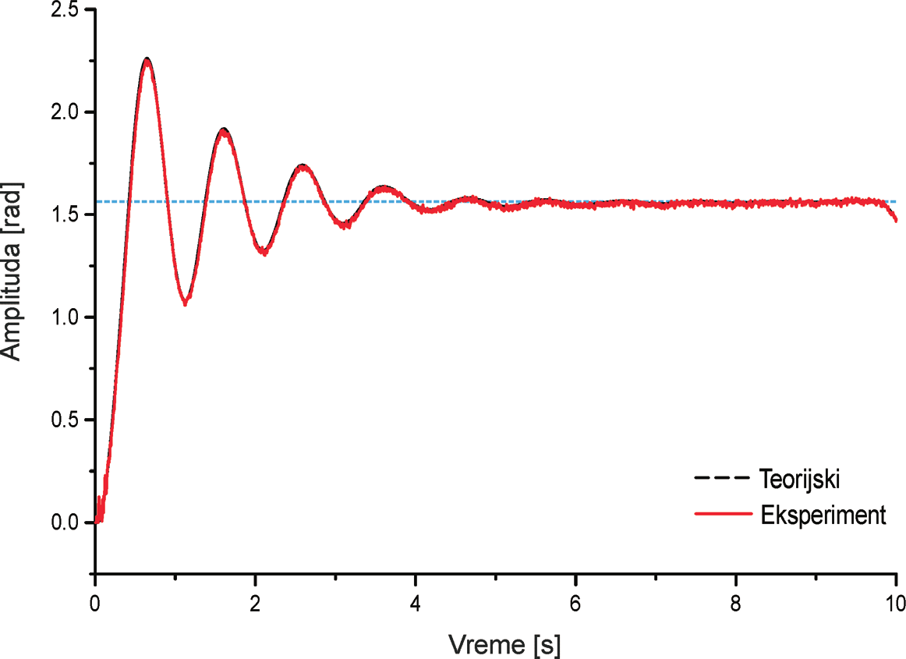
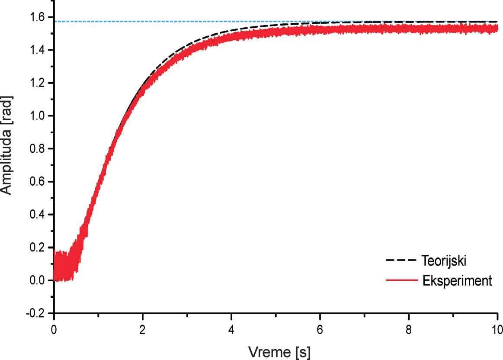
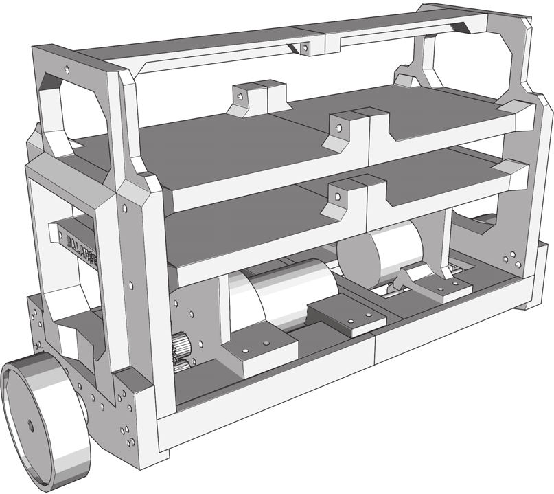

## Modeling, simulation and hardware implementation of a self-balancing robot

The aim of this paper is modeling, simulation and implementation of a self-balancing robot. The
problem of a self-balancing robot is considered as a problem of inverted pendulum stabilisation,
while a DC motor is used as the drive motor.

Deflection angle indicates the angle by which is the robot inclined to a side, in other words, by how
many degrees is the y-axis of the robot rotated from the absolute y-axis, so that the center of wheels
is exactly at the section of these axises.

In simulation, the deflection angle is measured in four ways: using a gyroscope, an accelerometer,
both gyroscope and accelerometer in combination using a complementary filter and both gyroscope
and accelerometer in combination using Kalman filter. These sensors are placed on the apex of the
robot in order to maximise the amplitude of measured values. Two types of stabilisation controllers
are used: PID and LQR. Respective performance of these regulators are compared relative to the
way that the angle is obtained.

Results of the simulation in which only a gyroscope is used indicate that this sensor accumulates
measuring error exceptionally fast, which results in a value over after just one second. Because
of this, stabilisation is not possible regardless of the regulator.
In the case of measuring using an accelerometer, a constant measuring error is observed and that the
presence of noise is more apparent than when a filter is used. Furthermore, noise’s amplitude is
greater with LQR regulator as a consequence of flickering noise, which is expected because the
current deflection angle changes at a quicker rate using PID. Contrary to LQR, stabilisation using
PID regulator has overshoot.

When a complementary filter is used, the gyroscope error accumulation is not observed and both
constant error and noise of an accelerometer are less pronounced. Similarly to previous case, noise
is more apparent with LQR, but overall noise is lower.
When Kalman filter is used, properties of the error and noise are similar to those from
complementary filter, except that the noise is of less amplitude. Regardless of the regulator type,
stabilisation is achieved with the lowest noise of all four cases. Noise is again lower when LQR
regulator is used due to the flickering noise.
All simulation hypotheses set during the initial problem analysis and modeling are confirmed: robot
can successfully stabilise regardless of regulator type, except when measurements are only acquired
from a gyroscope.

Unlike in simulation, PID regulator is only implemented in hardware where the measurements
represent output of a complementary filter of both gyroscope and accelerometer. Major setback in
hardware system emerged as a significant free movement in transfer of the motor torque to the
wheel axle; as a consequence, the robot can be displaced from balance and disable any further
stabilisation. The system is successfully put into stable oscillatory movement, but the stabilisation is
not possible and the hypothesis is not confirmed.
To review the plausibility of this hypothesis, further work should focus on removing the free
movement in mechanical transfer. Also, stabilisator performance should be observed when the
center of robot’s mass is shifted downwards, in other words, when additional weight is added to its
base.

## Modeliranje, simulacija i implementacija samobalansirajućeg robota

Cilj ovog rada je modeliranje, simulacija i izrada samobalansirajućeg robota.

Samobalansirajući
robot je mehanički sistem za kretanje po ravnim površinama sa kojima je u kontaktu preko para
točkova na jednoj osovini. Osnovna funkcionalnost ovakvog robota je samostalno održavanje centra
mase iznad ose rotacije.

Problem stabilizacije posmatran je kao problem stabilizacije inverznog fizičkog klatna, dok je kao
pogonski motor korišćen DC motor. U simulaciji, ugao otklona robota od pravca gravitacije, meren
je na četiri različita načina: pomoću žiroskopa, pomoću akcelerometra, pomoću žiroskopa i
akcelerometra zajedno u kombinaciji sa komplementarnim filterom i pomoću žiroskopa i
akcelerometra zajedno u kombinaciji sa Kalmanovim filterom.

U hardverskoj implementaciji korišćeni su žiroskop i akcelerometar u kombinaciji sa
komplemetarnim filterom. U simulaciji su korišćene dve vrste stabilizatora: PID i LQR, dok je u
hardveru implementiran samo PID regulator. Poređene su performanse stabilizacije sa ovim
stabilizatorima u odnosu na način estimacije ugla.

U simulaciji dobijeno je da je stabilizacija nemoguća ukoliko se koristi samo žiroskop, dok je
stabilizacija u ostalim slučajevima moguća. Najbolje performanse su dobijene ako se ugao otklona
meri pomoću žiroskopa i akcelerometra zajedno u kombinaciji sa Kalmanovim filterom. U hardveru
nije bilo moguće izvršiti potpunu stabilizaciju sistema zbog velikog slobodnog hoda motora jer bi se
robot stalno izvodio iz ravnotežnog položaja.

|  |  |
| -- | -- |
| Robot deflection as a function of time using PID controller and complementary filter inside the simulation | Robot deflection as a function of time using LQR controller and complementary filter inside the simulation |
| Zavisnost nagiba robota od vremena sa PID regulatorom i komplementarnim filtrom u simulaciji | Zavisnost nagiba robota od vremena sa LQR regulatorom i komplementarnim filtrom u simulaciji |

|  |
| -- |
| Robot deflection as a function of time using PID controller and Kalman filter |
| Zavisnost nagiba robota od vremena sa PID regulatorom i komplementarnim filtrom |

|  | 
| -- |
| 3D render of the assembled robot |
| 3D prikaz sklopljenog robota |